# Ατομικό Παραδοτέο Sprint 3

**Μάθημα:** Μεθοδολογίες Ανάπτυξης Πληροφοριακών Συστημάτων  
**Project:** Pet Adoption Platform  
**Ομάδα:** 3  
**Φοιτητής/τρια:** `[Ονοματεπώνυμο]`  
**ΑΜ:** `[ΑΜ]`  
**Ρόλος στο Sprint:** `[Scrum Master / Team Member]`  
**Ημερομηνία:** `[Ημερομηνία παράδοσης]`  
**Git Repository:** `[Σύνδεσμος GitHub/GitLab repository]`  
**Project Management Tool:** `[Zenhub/Jira link ή screenshot αναφοράς]`

> **Σημείωση πριν τη μετατροπή σε PDF:** Αντικατάστησε όλα τα πεδία σε `[ ]`, κράτησε τις ενότητες που αφορούν τη δική σου συνεισφορά, πρόσθεσε screenshots όπου ζητούνται και βεβαιώσου ότι ο σύνδεσμος του repository είναι ενεργός.

---

## 1. Sprint Planning & Κατανομή Εργασιών

### 1.1 Επιλεγμένα User Stories

Στο Sprint 3 επιλέχθηκαν User Stories από το Product Backlog της 2ης εργασίας, με στόχο να υλοποιηθεί ένα λειτουργικό πληροφοριακό σύστημα υιοθεσίας κατοικιδίων.

| User Story | Περιγραφή | Κριτήριο Ολοκλήρωσης | Υλοποιήθηκε |
|---|---|---|---|
| US1.1 | Εγγραφή χρήστη | Ο χρήστης μπορεί να δημιουργήσει λογαριασμό | `[Ναι/Όχι]` |
| US1.2 | Σύνδεση χρήστη | Ο χρήστης μπορεί να συνδεθεί και να λάβει session/JWT | `[Ναι/Όχι]` |
| US2.1 | Λίστα κατοικιδίων | Εμφανίζονται διαθέσιμα ζώα προς υιοθεσία | `[Ναι/Όχι]` |
| US2.2 | Φίλτρα αναζήτησης | Ο χρήστης φιλτράρει με είδος, ηλικία, φύλο, τοποθεσία | `[Ναι/Όχι]` |
| US2.3 | Προφίλ ζώου | Εμφανίζονται πλήρη στοιχεία ζώου και καταφυγίου | `[Ναι/Όχι]` |
| US3.1 | Αίτηση υιοθεσίας | Ο χρήστης υποβάλλει αίτηση για ζώο | `[Ναι/Όχι]` |
| US3.2 | Επιβεβαίωση αίτησης | Εμφανίζεται μήνυμα επιτυχούς υποβολής | `[Ναι/Όχι]` |
| US4.1 | Dashboard καταφυγίου | Το καταφύγιο βλέπει αιτήσεις για τα ζώα του | `[Ναι/Όχι]` |
| US4.2 | Έγκριση/Απόρριψη | Το καταφύγιο εγκρίνει ή απορρίπτει αίτηση | `[Ναι/Όχι]` |
| US5.1 | Admin στατιστικά | Ο διαχειριστής βλέπει βασικά στατιστικά | `[Ναι/Όχι]` |
| US5.2 | Admin αναφορά | Ο διαχειριστής βλέπει αναλυτική αναφορά | `[Ναι/Όχι]` |

### 1.2 Κατανομή Εργασιών Ομάδας

| Μέλος | ΑΜ | Ρόλος | Κύρια ευθύνη | Ενδεικτικά tasks |
|---|---|---|---|---|
| Δαμιανός Ζούμπος | Ε22056 | Scrum Master | Backend Auth, συντονισμός | DB schema, auth backend, integration |
| Κλαυδιανός Άγγελος | Ε22081 | Team Member | Frontend Pet Browse | Pet list, filters, pet profile |
| Αλεσία Γκίνι | Ε22043 | Team Member | Frontend Auth UI & Profile | Register/Login UI, profile page |
| Χρήστος Μπινάς | Ε22114 | Team Member | Backend Pets & Shelter | Pet endpoints, upload, shelter endpoints |
| Ιωάννης Ταχμαζίδης | Ε22164 | Team Member | Backend Adoption & Admin | Adoption flow, approval logic, admin APIs |

### 1.3 Προσωπική Συνεισφορά

| Task ID / User Story | Τι υλοποίησα προσωπικά | Αρχεία/ενότητες κώδικα | Κατάσταση |
|---|---|---|---|
| `[π.χ. PB27 / US3.1]` | `[Περιγραφή εργασίας]` | `[π.χ. backend/src/routes/adoptions.js]` | `[Ολοκληρώθηκε/Μερικώς]` |
| `[Task]` | `[Περιγραφή]` | `[Αρχεία]` | `[Κατάσταση]` |

---

## 2. Αρχιτεκτονική & Τεχνολογική Στοίβα

### 2.1 Τεχνολογίες που χρησιμοποιήθηκαν

| Layer | Τεχνολογία | Ρόλος στο σύστημα |
|---|---|---|
| Frontend | React, React Router, Axios | UI, πλοήγηση, επικοινωνία με REST API |
| Backend | Node.js, Express | REST endpoints και business logic |
| Database | PostgreSQL | Αποθήκευση χρηστών, ζώων, αιτήσεων, καταφυγίων |
| Authentication | JWT, bcryptjs | Σύνδεση, ρόλοι, προστατευμένα routes |
| File Upload | multer | Ανέβασμα φωτογραφιών ζώων |
| DevOps | Docker, Docker Compose, GitHub Actions | Τοπική εκτέλεση και βασική CI/CD υποδομή |

### 2.2 Σύνδεση με DFD/HIPO διαγράμματα

Οι τεχνολογικές επιλογές υποστηρίζουν τα βασικά processes του DFD Level 1 και τα αντίστοιχα HIPO modules:

| Process / Module | Υλοποίηση στο project | Περιγραφή |
|---|---|---|
| User Registration / Login | `/api/auth`, Auth UI | Δημιουργία λογαριασμού, σύνδεση, JWT |
| Pet Search | `/api/pets`, Pet List UI | Ανάκτηση ζώων και αναζήτηση με φίλτρα |
| Pet Profile | `/api/pets/:id`, Pet Profile UI | Αναλυτική προβολή ζώου και καταφυγίου |
| Adoption Request | `/api/adoptions`, Adoption Form UI | Υποβολή και παρακολούθηση αιτήσεων |
| Shelter Management | `/api/adoptions/shelter`, Shelter Dashboard | Έλεγχος αιτήσεων από καταφύγια |
| Admin Control | `/api/admin/stats`, `/api/admin/report` | Στατιστικά και αναφορές συστήματος |

### 2.3 Συνοπτική αρχιτεκτονική ροή

```text
React Frontend
  -> Axios HTTP requests
  -> Express REST API
  -> PostgreSQL database
  -> JSON responses back to UI
```

---

## 3. Τεκμηρίωση Ανάπτυξης με Coding Agents

### 3.1 Εργαλεία που χρησιμοποιήθηκαν

| Εργαλείο / Πλατφόρμα | Χρήση | Παραδείγματα εργασιών |
|---|---|---|
| `[π.χ. Claude Code]` | `[Παραγωγή/διόρθωση κώδικα]` | `[π.χ. Express routes, React components]` |
| `[π.χ. GitHub Copilot]` | `[Autocomplete/βοήθεια υλοποίησης]` | `[π.χ. helper functions, CSS]` |
| `[π.χ. ChatGPT]` | `[Ανάλυση, debugging, documentation]` | `[π.χ. README, retrospective]` |

### 3.2 Προσωπικό ιστορικό prompts

> Πρόσθεσε τα σημαντικότερα prompts που χρησιμοποίησες. Δεν αρκεί να αναφέρεις ότι χρησιμοποιήθηκε AI· πρέπει να φαίνεται τι ζητήθηκε, τι παρήχθη και τι άλλαξες χειροκίνητα.

#### Prompt 1

**Ημερομηνία:** `[YYYY-MM-DD]`  
**Tool:** `[Claude Code / Copilot / ChatGPT / άλλο]`  
**Task:** `[Task ID ή User Story]`  

**Prompt που δόθηκε:**

```text
[Ακριβές ή αντιπροσωπευτικό prompt]
```

**Αποτέλεσμα:**

- `[Τι κώδικα/τεκμηρίωση παρήγαγε το εργαλείο]`
- `[Τι έλεγξα ή τροποποίησα χειροκίνητα]`
- `[Αν χρειάστηκε δεύτερο prompt ή debugging]`

**Ορθές πρακτικές που ακολουθήθηκαν:**

- `[π.χ. Δόθηκε context για stack/API πριν ζητηθεί κώδικας]`
- `[π.χ. Έγινε review πριν ενσωματωθεί]`
- `[π.χ. Έγινε δοκιμή με build/lint/manual flow]`

#### Prompt 2

**Ημερομηνία:** `[YYYY-MM-DD]`  
**Tool:** `[Tool]`  
**Task:** `[Task ID ή User Story]`  

**Prompt που δόθηκε:**

```text
[Prompt]
```

**Αποτέλεσμα:**

- `[Αποτέλεσμα]`
- `[Χειροκίνητες αλλαγές]`
- `[Έλεγχος/δοκιμή]`

---

## 4. Ιχνηλασιμότητα & Κριτήρια Ολοκλήρωσης

### 4.1 Πίνακας αντιστοίχισης User Stories με αποδείξεις

| User Story | Υλοποίηση | Απόδειξη / Screenshot | Σχόλια |
|---|---|---|---|
| US1.1 Register | `[Αρχείο/route/component]` | `docs/screenshots/US1.1-register.png` | `[Σχόλιο]` |
| US1.2 Login | `[Αρχείο/route/component]` | `docs/screenshots/US1.2-login.png` | `[Σχόλιο]` |
| US2.1 Pet List | `[Αρχείο/route/component]` | `docs/screenshots/US2.1-pet-list.png` | `[Σχόλιο]` |
| US2.2 Pet Filters | `[Αρχείο/route/component]` | `docs/screenshots/US2.2-pet-filters.png` | `[Σχόλιο]` |
| US2.3 Pet Profile | `[Αρχείο/route/component]` | `docs/screenshots/US2.3-pet-profileV2.png` | `[Σχόλιο]` |
| US3.1 Adoption Form | `[Αρχείο/route/component]` | `docs/screenshots/US3.1-adoption-form.png` | `[Σχόλιο]` |
| US3.2 Adoption Success | `[Αρχείο/route/component]` | `docs/screenshots/US3.2-adoption-success.png` | `[Σχόλιο]` |
| US4.1 Shelter Requests | `[Αρχείο/route/component]` | `docs/screenshots/US4.1-shelter-requests.png` | `[Σχόλιο]` |
| US4.2 Shelter Approval | `[Αρχείο/route/component]` | `docs/screenshots/US4.2-shelter-approved.png` | `[Σχόλιο]` |
| US5.1 Admin Stats | `[Αρχείο/route/component]` | `docs/screenshots/US5.1-admin-stats.png` | `[Σχόλιο]` |
| US5.2 Admin Report | `[Αρχείο/route/component]` | `docs/screenshots/US5.2-admin-report.png` | `[Σχόλιο]` |

### 4.2 Screenshots εφαρμογής

> Για το PDF, βάλε τις εικόνες κάτω από κάθε υποενότητα. Αν το αρχείο Markdown μετατραπεί με εργαλείο που υποστηρίζει εικόνες, κράτησε την παρακάτω μορφή.

#### US1.1 — Εγγραφή χρήστη

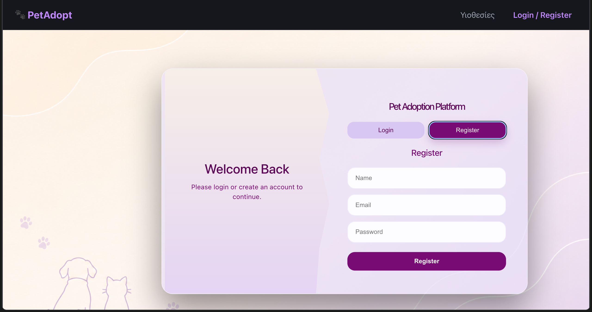

#### US1.2 — Σύνδεση χρήστη

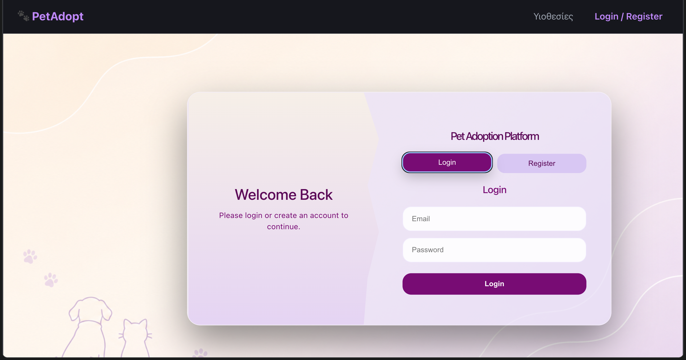

#### US2.1 — Λίστα κατοικιδίων

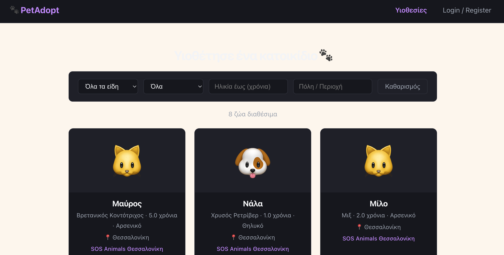

#### US2.2 — Φίλτρα αναζήτησης

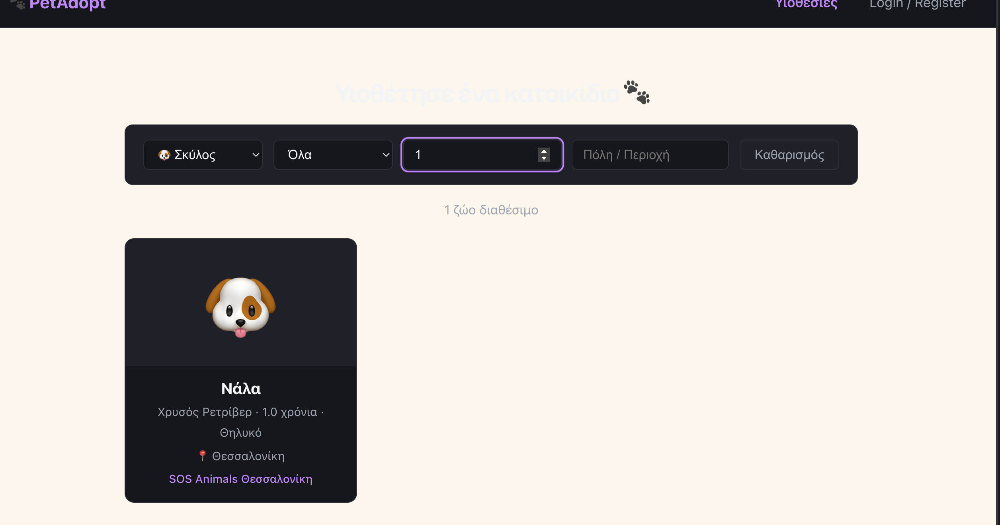

#### US2.3 — Προφίλ ζώου

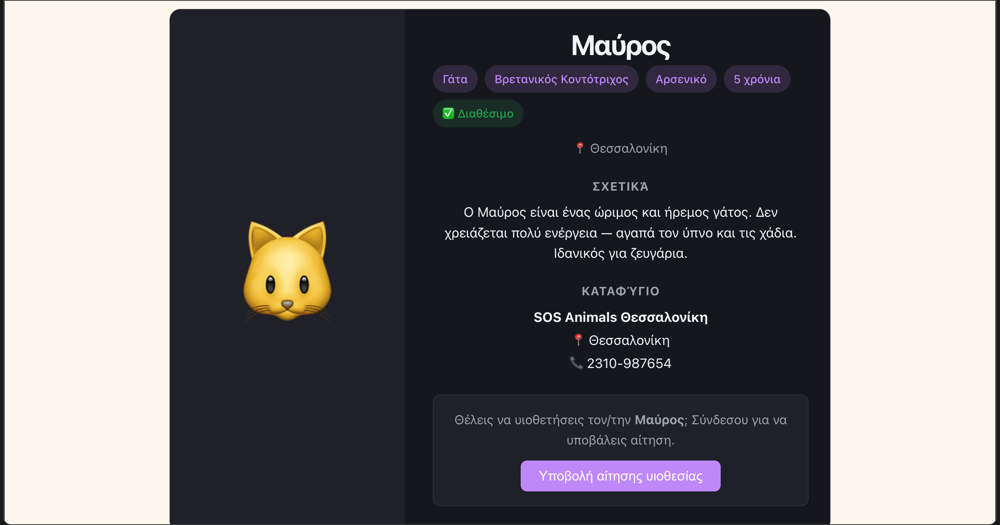

#### US3.1 — Φόρμα αίτησης υιοθεσίας

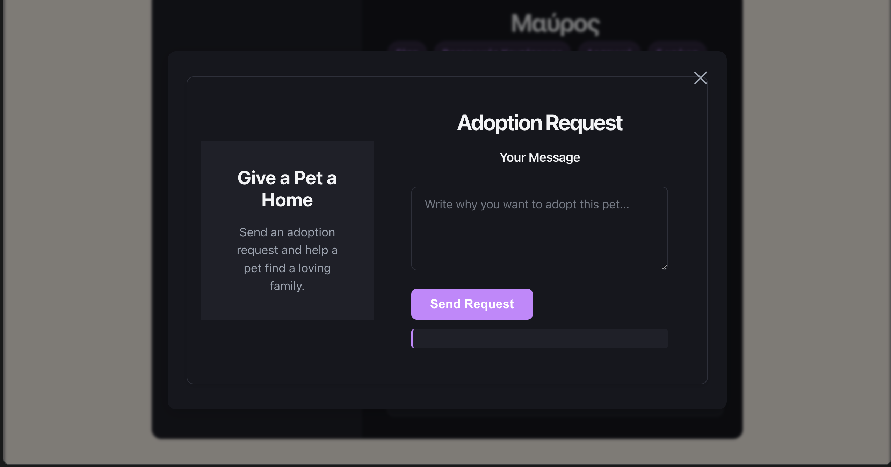

#### US3.2 — Επιβεβαίωση αίτησης

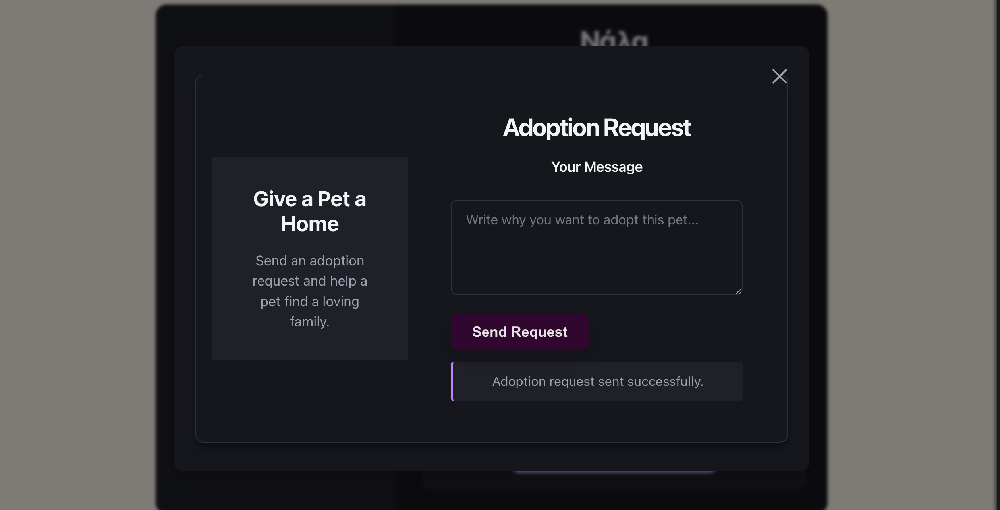

#### US4.1 — Αιτήσεις καταφυγίου

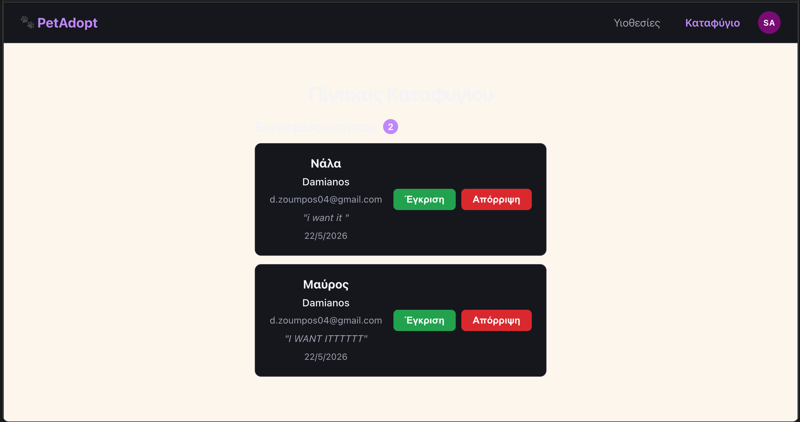

#### US4.2 — Έγκριση/Απόρριψη αίτησης

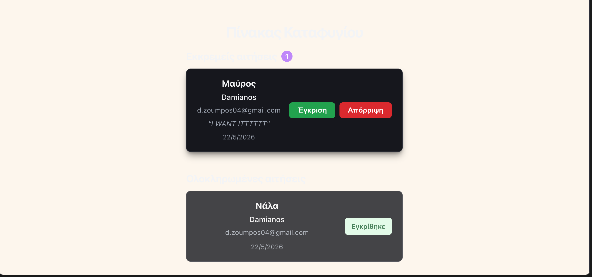

#### US5.1 — Admin στατιστικά

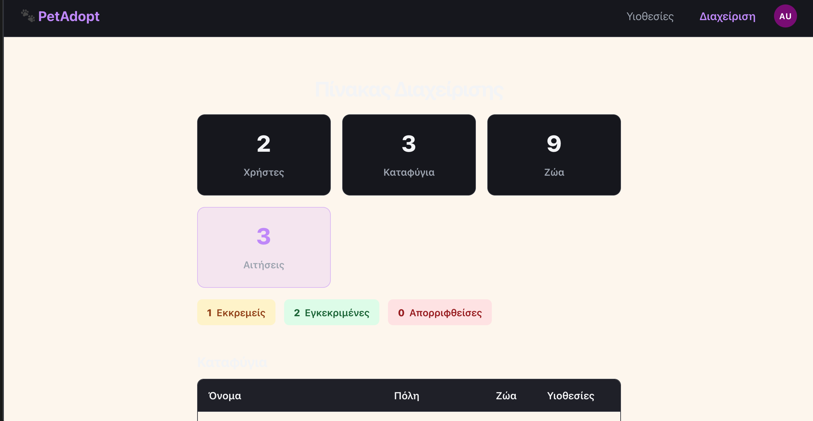

#### US5.2 — Admin αναφορά

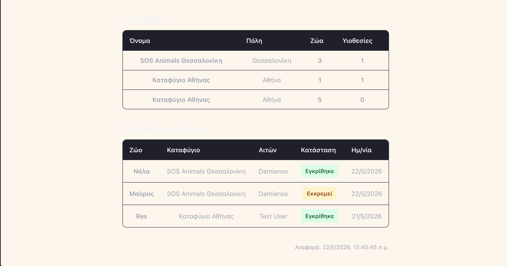

### 4.3 Έλεγχοι που εκτελέστηκαν

| Έλεγχος | Εντολή / Διαδικασία | Αποτέλεσμα |
|---|---|---|
| Frontend build | `cd frontend && npm run build` | `[Πέρασε/Απέτυχε + σχόλιο]` |
| Frontend lint | `cd frontend && npm run lint` | `[Πέρασε/Απέτυχε + σχόλιο]` |
| Backend syntax check | `node --check ...` | `[Πέρασε/Απέτυχε + σχόλιο]` |
| Manual E2E flow | Register → Login → Search → Adoption → Approval → Admin report | `[Πέρασε/Απέτυχε + σχόλιο]` |

---

## 5. Sprint Retrospective

### 5.1 Τι πήγε καλά

- `[Παράδειγμα: Η ύπαρξη API spec βοήθησε το frontend και backend να δουλεύουν παράλληλα.]`
- `[Παράδειγμα: Η κατανομή εργασιών ανά ρόλο μείωσε τις συγκρούσεις στο git.]`
- `[Προσωπική παρατήρηση]`

### 5.2 Τι δυσκόλεψε την ομάδα

- `[Παράδειγμα: Ρυθμίσεις Docker/PostgreSQL ή διαφορετικά local environments.]`
- `[Παράδειγμα: Ενοποίηση frontend με πραγματικά endpoints.]`
- `[Προσωπική δυσκολία]`

### 5.3 Τι έμαθα από τη διαδικασία

- `[Τεχνική γνώση που απέκτησα]`
- `[Τι έμαθα για συνεργασία με git/project management]`
- `[Τι έμαθα για σωστή χρήση Coding Agents]`

### 5.4 Τι θα βελτιώναμε σε επόμενο Sprint

- `[Πρόταση βελτίωσης 1]`
- `[Πρόταση βελτίωσης 2]`
- `[Πρόταση βελτίωσης 3]`

---

## 6. Git Repository

**Repository URL:** `[βάλε εδώ το GitHub/GitLab repository link]`

**Branch ή commit που αντιστοιχεί στο παραδοτέο:** `[branch name ή commit hash]`

**Σύντομη περιγραφή repository:**

- `backend/`: Express API, PostgreSQL σύνδεση, authentication, pets/adoptions/admin routes.
- `frontend/`: React UI για auth, pet browsing, adoption requests, shelter dashboard, admin panel.
- `docs/`: API specification, screenshots, prompt history και βοηθητική τεκμηρίωση.
- `docker-compose.yml`: Τοπική εκτέλεση PostgreSQL, backend και frontend.

---

## 7. Τελική Δήλωση Συνεισφοράς

Δηλώνω ότι η παραπάνω εργασία περιγράφει τη δική μου συμμετοχή στο project. Τα εργαλεία Coding Agents χρησιμοποιήθηκαν ως βοηθοί ανάπτυξης και τεκμηρίωσης, ενώ ο κώδικας και τα αποτελέσματα ελέγχθηκαν και προσαρμόστηκαν σύμφωνα με τις ανάγκες της ομάδας και τα παραδοτέα του μαθήματος.

**Ονοματεπώνυμο:** `[Ονοματεπώνυμο]`  
**ΑΜ:** `[ΑΜ]`  
**Ημερομηνία:** `[Ημερομηνία]`
