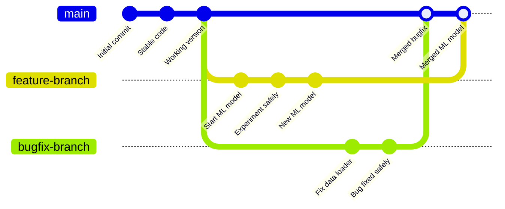
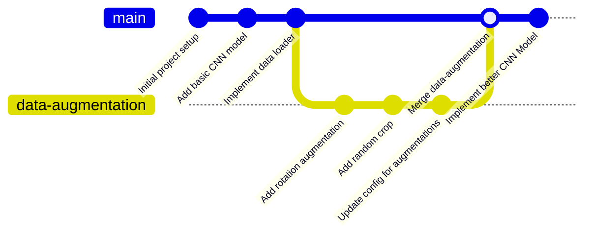

# Git Branches and Pull Requests

## What are Branches?

Think of a **branch** as a parallel timeline for your project. The main timeline (called `main`) contains the stable, working version of your code. Branches let you create alternate timelines where you can experiment, develop features, or fix bugs without affecting the main code.

### Visual Analogy: A Tree



## Why Do We Use Branches?

### 1. **Safe Experimentation**

**Problem**: You want to try a new attention mechanism in your transformer model, but you don't want to break the working version.

**Solution**: Create a `feature/attention-mechanism` branch, experiment there, and keep the main branch stable.

### 2. **Parallel Development**

**Scenario**: Your AI research team is working on different parts:

- **Maria**: Adding data augmentation (`feature/data-augmentation`)
- **John**: Writing evaluation metrics (`feature/evaluation`)
- **You**: Hyperparameter optimization (`feature/hyperparams`)

Everyone works simultaneously without interfering with each other!

### 3. **Code Review**

Before integrating experimental code into the main project, your team can review it to ensure:

- The code works correctly
- It follows coding standards
- It doesn't break existing functionality
- The approach makes scientific sense

### 4. **Version History**

Each branch maintains its own history, making it easy to:

- Track the development of specific features
- Revert problematic changes
- Understand the evolution of your research

## How Branches Work

### Creating and Using Branches

```bash
# See all branches (current branch marked with *)
git branch

# Create and switch
git checkout -b feature/new-model

# Switch to an existing branch
git checkout feature/new-model
```

### Branch Workflow Example

Let's say you want to add a new CNN architecture:

```bash
# 1. Start from the latest main branch
git checkout main
git pull origin main

# 2. Create a new branch for your feature
git checkout -b feature/resnet-architecture

# 3. Make your changes
# Edit model.py, add new architecture

# 4. Commit your changes
git add model.py
git commit -m "Add ResNet-50 architecture implementation"

# 5. Push your branch to GitHub
git push origin feature/resnet-architecture

# 6. Create a pull request
```



## Branch Naming Conventions

Good branch names are descriptive and follow a pattern:

**For Features**:

- `feature/transformer-model`
- `feature/data-augmentation`
- `feature/preprocessing`

**For Bug Fixes**:

- `fix/data-loading-error`

**For Experiments**:

- `experiment/different-optimizer`
- `research/gan-architecture`
- `test/new-preprocessing`

## What are Pull Requests (PRs)?

A **Pull Request** is a formal way to say:

> "Hey team, I've finished working on this feature/fix in my branch. Please review my code and consider merging it into the main branch."

### Pull Request Workflow

1. **Create**: Open a PR on GitHub comparing your branch to main
2. **Describe**: Explain what you changed and why
3. **Review**: Team members examine your code
4. **Discuss**: Comment on specific lines, suggest improvements
5. **Approve**: Reviewers give thumbs up
6. **Merge**: Code is integrated into main branch
7. **Clean up**: Delete the feature branch

### Creating a Pull Request - Example

On GitHub:

1. Go to your repository
2. Click "Compare & pull request" (appears after pushing a branch)
3. Write a clear title and description:

````markdown
# Example PR Description

## What this PR does

Implements ResNet-50 architecture for image classification

## Changes made

- Added ResNet class in `models/resnet.py`
- Updated model factory in `model_utils.py`
- Updated documentation

## How to test

```python
from models.resnet import ResNet50
model = ResNet50(num_classes=10)
```

## Performance (Optional)

- Achieves 95% accuracy on CIFAR-10
- Training time: 2.3x faster than previous model
````

4. Assign reviewers (your teammates)
5. Create the pull request

## Best Practices for Research Teams

### 1. **Branch Early, Branch Often**

- Create a new branch for each experiment
- Don't let branches live too long (merge within 1-2 weeks)

### 2. **Descriptive Names and Messages**

```bash
# Good
git checkout -b experiment/bert-vs-roberta-comparison

# Bad
git checkout -b test123
```

### 3. **Keep Branches Focused**

- One branch = one feature/experiment/fix
- Don't mix unrelated changes

### 4. **Write Great PR Descriptions**

Include:

- What problem you're solving
- How you solved it
- What tests you ran
- Performance implications
- Any breaking changes

### 5. **Regular Synchronization** (Extra)

```bash
# Keep your branch up to date with main
git checkout main
git pull origin main
git checkout your-branch
git merge main
```

## Common Commands Quick Reference

| Task               | Command                       |
| ------------------ | ----------------------------- |
| List branches      | `git branch`                  |
| Create branch      | `git branch branch-name`      |
| Switch branches    | `git checkout branch-name`    |
| Create + switch    | `git checkout -b branch-name` |
| Delete branch      | `git branch -d branch-name`   |
| Push branch        | `git push origin branch-name` |
| Merge branch       | `git merge branch-name`       |
| See branch history | `git log --oneline --graph`   |

## Team Workflow Example

Here's how your AI research team might work on a computer vision project:

1. **Project starts**: Create repository with `main` branch
2. **Sprint planning**: Decide who works on what
3. **Individual work**: Everyone creates their feature branches
   - `feature/data-loading` (Maria)
   - `feature/cnn-model` (John)
   - `feature/evaluation` (You)
4. **Development**: Work in parallel, commit regularly
5. **Code review**: Create pull requests, review each other's code
6. **Integration**: Merge approved PRs into main

This workflow ensures:

- ✅ Everyone can work independently
- ✅ Code quality through reviews
- ✅ Stable main branch always
- ✅ Clear history of what was developed when
- ✅ Easy to reproduce results for papers


**Remember**: Branches are cheap and powerful - use them liberally to organize your research and experiments!

CREDITS TO : https://github.com/steliosgrs
