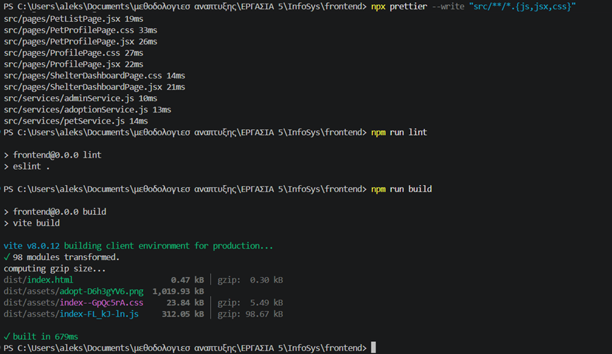

# Παραδοτέο Sprint 3 — DevOps & Quality Assurance

**Μάθημα:** Μεθοδολογίες Ανάπτυξης Πληροφοριακών Συστημάτων  
**Ομάδα:** 3  
**Φοιτητής:** Δαμιανός Ζούμπος — **ΑΜ:** Ε22056  
**Ρόλος:** Scrum Member · Backend Auth & CI/CD Deployment  
**Αποθετήριο:** https://github.com/Damianzoub/InfoSys

---

## Ομάδα & Κατανομή Ευθυνών

| Όνομα | ΑΜ | Ρόλος | Ευθύνη Sprint 3 |
|---|---|---|---|
| Δαμιανός Ζούμπος | Ε22056 | Scrum Member | CI/CD pipeline, Railway deployment, continuous delivery |
| Κλαυδιανός Άγγελος | Ε22081 | Team Member | Frontend pet-browse |
| Αλεσία Γκίνι | Ε22043 | Team Member | Code Quality — ESLint & Prettier |
| Χρήστος Μπινάς | Ε22114 | Team Member | Shelter features |
| Ιωάννης Ταχμαζίδης | Ε22164 | Team Member | DevOps Strategy & Release Management |

---

## 1. Στρατηγική DevOps & Διαχείριση Εκδόσεων

### 1.1 Επιλεγμένα Εργαλεία

Ο βασικός μας στόχος ήταν να χτίσουμε μια αυτοματοποιημένη διαδικασία παράδοσης χωρίς να χρειαστεί να στήσουμε ή να συντηρούμε δική μας υποδομή. Για αυτό επιλέξαμε εργαλεία που ενσωματώνονται φυσικά με το GitHub όπου ήδη φιλοξενείται ο κώδικάς μας.

| Εργαλείο | Ρόλος |
|---|---|
| **GitHub Actions** | Αυτοματοποίηση CI/CD — εκτελείται σε κάθε push/PR |
| **Docker** | Containerization του backend |
| **Docker Compose** | Τοπική ενορχήστρωση όλων των services |
| **Railway** | Cloud hosting — backend, frontend, PostgreSQL |
| **Jest + Supertest** | Unit & integration tests |
| **ESLint + Prettier** | Ποιότητα & μορφοποίηση κώδικα frontend |

### 1.2 Στρατηγική Διαχείρισης Branches (GitHub Flow)

Υιοθετήσαμε το **GitHub Flow**: ένα μόνιμο, πάντα deployable κλαδί (`main`) και βραχύβια κλαδιά ανά feature που ενσωματώνονται μέσω Pull Request.

```
feature/* ──► Pull Request ──► CI (tests + lint + build) ──► Review ──► merge ──► main
                                                                                    │
                                                                                    ▼
                                                                      Railway auto-deploy
```

**Κανόνες:**
- Κανείς δεν κάνει push απευθείας στο `main`
- Κάθε αλλαγή ανοίγει Pull Request που πρέπει να περάσει τα CI checks
- Commits ακολουθούν Conventional Commits: `feat(scope): message`, `fix(scope): message`

**Γιατί GitHub Flow και όχι Git Flow:**  
Το πλήρες Git Flow (με `develop`, `release/*`, `hotfix/*`) είναι σχεδιασμένο για προϊόντα με προγραμματισμένες εκδόσεις. Για ένα ακαδημαϊκό project ενός sprint, η επιπλέον πολυπλοκότητα δεν προσφέρει αξία.

### 1.3 Διαχείριση Secrets

Καμία ευαίσθητη πληροφορία δεν βρίσκεται στον κώδικα ή στα images:

- Το `.env` είναι **gitignored** — στο repo υπάρχει μόνο το `backend/.env.example` με placeholders
- Το `JWT_SECRET` στο CI δίνεται ως environment variable του job (`supersecretkeyfortesting`)
- Στο Railway, το `JWT_SECRET` εισάγεται μέσω του dashboard (όχι στον κώδικα)
- Το `DATABASE_URL` εισάγεται αυτόματα από το Railway όταν συνδέεται η PostgreSQL υπηρεσία
- Η σύνδεση στο GHCR γίνεται με το αυτόματο `GITHUB_TOKEN` — δεν αποθηκεύουμε δικά μας credentials

---

## 2. Αυτοματοποιημένος Έλεγχος (Automated Testing)

### 2.1 Στρατηγική Ελέγχου

Υλοποιήσαμε **unit και integration tests** για το backend API χρησιμοποιώντας **Jest** και **Supertest**. Τα tests τρέχουν αυτόματα σε κάθε push μέσω του GitHub Actions pipeline.

**Φιλοσοφία:**  
Αντί να χτίσουμε tests που απαιτούν live database, επιλέξαμε να κάνουμε **mock το database layer**. Έτσι τα tests τρέχουν γρήγορα και αξιόπιστα σε κάθε περιβάλλον (local, CI runner) χωρίς εξωτερικές εξαρτήσεις.

### 2.2 Τι Ελέγχεται

Τα tests καλύπτουν τις κρίσιμες λειτουργίες της εφαρμογής:

**Authentication (`/api/auth`):**
- `POST /register` — validation πεδίων, duplicate email (409), επιτυχής εγγραφή (201)
- `POST /login` — λάθος credentials (401), επιτυχής login με JWT token (200)
- `GET /me` — προστατευμένο endpoint, validation JWT

**Pets (`/api/pets`):**
- `GET /pets` — λίστα διαθέσιμων ζώων με φίλτρα
- `GET /pets/:id` — ανάκτηση συγκεκριμένου ζώου

**Adoptions (`/api/adoptions`):**
- `POST /adoptions` — υποβολή αίτησης, validation, duplicate prevention

### 2.3 Εκτέλεση Tests

```bash
cd backend
npm test              # τοπική εκτέλεση
npm run test:ci       # με coverage report (χρησιμοποιείται στο CI)
```

Το `test:ci` παράγει αναφορά κάλυψης κώδικα (coverage) που ανεβαίνει ως artifact στο GitHub Actions.

### 2.4 Ένταξη στο Pipeline

Τα tests εκτελούνται αυτόματα ως **το πρώτο βήμα** του pipeline. Αν αποτύχουν, το υπόλοιπο pipeline δεν συνεχίζει — άρα ο broken κώδικας δεν φτάνει ποτέ στο `main`.

```yaml
- name: 🧪 Run Backend Tests
  working-directory: ./backend
  env:
    JWT_SECRET: supersecretkeyfortesting
  run: npm test
```


---

## 3. Σχεδιασμός & Υλοποίηση CI/CD Pipeline

### 3.1 Επισκόπηση Pipeline

Το pipeline ορίζεται στο αρχείο `.github/workflows/pipeline.yml` και εκτελείται αυτόματα σε κάθε `push` στο `main` και σε κάθε Pull Request.

```
Push / PR
    │
    ▼
┌─────────────────── Job: build-and-test ───────────────────┐
│  1. Checkout repository                                   │
│  2. Setup Node.js 22                                      │
│  3. npm install (backend) → npm test                      │
│  4. npm install (frontend) → npm run build                │
│  5. npm run lint (ESLint)                                 │
│  6. npm run format:check (Prettier)                       │
│  7. npm run build (frontend — επαλήθευση)                 │
└───────────────────────────────────────────────────────────┘
    │ (μόνο αν πετύχει)
    ▼
┌─────────────────── Job: deploy ───────────────────────────┐
│  Railway auto-deploys από το main branch                  │
│  (backend Docker build + frontend Caddy static serve)     │
└───────────────────────────────────────────────────────────┘
```

### 3.2 Αναλυτική Περιγραφή Σταδίων

**Στάδιο 1 — Εγκατάσταση & Tests:**
```yaml
- name: 📦 Install Backend Dependencies
  working-directory: ./backend
  run: npm install

- name: 🧪 Run Backend Tests
  working-directory: ./backend
  env:
    JWT_SECRET: supersecretkeyfortesting
  run: npm test
```

**Στάδιο 2 — Frontend Build & Quality:**
```yaml
- name: 📦 Install Frontend Dependencies & Build
  working-directory: ./frontend
  run: |
    npm install
    npm run build

- name: 🔍 Run Frontend Lint
  working-directory: ./frontend
  run: npm run lint

- name: 🎨 Check Frontend Formatting
  working-directory: ./frontend
  run: npm run format:check
```

**Στάδιο 3 — Deploy:**  
Το Railway παρακολουθεί το `main` branch και ξεκινά αυτόματα νέο deployment κάθε φορά που γίνεται push. Δεν χρειάζεται χειροκίνητο βήμα.

### 3.3 Αποτελέσματα Pipeline


Το pipeline ολοκληρώνεται σε **~33 δευτερόλεπτα** συνολικά.

---

## 4. Συνεχής Παράδοση / Ανάπτυξη (Continuous Delivery)

### 4.1 Πακετάρισμα της Εφαρμογής

Το backend πακετάρεται ως **Docker image** βασισμένο στο `node:22-alpine`. Το image ορίζεται στο `backend/Dockerfile`:

```dockerfile
FROM node:22-alpine
WORKDIR /app
COPY package*.json ./
RUN npm ci --omit=dev      # μόνο production dependencies
COPY src/ ./src/
COPY scripts/ ./scripts/
RUN mkdir -p uploads
EXPOSE 8000
CMD ["node", "src/server.js"]
```

**Βασικές επιλογές:**
- `node:22-alpine` — ελαφρύ image (~150 MB), μικρή επιφάνεια επίθεσης
- `npm ci --omit=dev` — ακριβώς ό,τι λέει το lock file, χωρίς dev tools
- Dependencies layer πριν τον κώδικα — αξιοποίηση Docker layer cache

### 4.2 Cloud Deployment — Railway

Η εφαρμογή είναι live σε **τρεις υπηρεσίες** στο Railway:

| Υπηρεσία | Τεχνολογία | Live URL |
|---|---|---|
| Backend API | Docker (Express) | https://pet-adoption-frontend-production-c743.up.railway.app |
| Frontend | Static (Vite + Caddy) | https://infosys-production-e27a.up.railway.app |
| Database | Managed PostgreSQL 16 | (εσωτερικό δίκτυο Railway) |

**Backend — `backend/railway.toml`:**
```toml
[build]
builder = "dockerfile"
dockerfilePath = "Dockerfile"

[deploy]
healthcheckPath = "/health"
healthcheckTimeout = 300
restartPolicyType = "on_failure"
restartPolicyMaxRetries = 3
```

**Frontend — `frontend/Caddyfile`:**  
Το React frontend χρειάζεται SPA routing — κάθε path πρέπει να σερβίρεται από το `index.html` ώστε το React Router να το χειριστεί:

```
:{$PORT:80} {
    root * /app/dist
    encode gzip
    try_files {path} /index.html
    file_server
}
```

Χωρίς `try_files`, το refresh σε οποιοδήποτε path εκτός από `/` επέστρεφε 404.

### 4.3 Ροή Continuous Delivery

```
Developer push στο main
        │
        ▼
pipeline.yml — tests + lint + build (GitHub Actions)
        │ ✅ pass
        ▼
Railway εντοπίζει νέο commit
        │
        ├── Backend: Docker build → healthcheck /health → Active
        └── Frontend: npm run build → Caddy serve dist/ → Active
                │
                ▼
        Εφαρμογή live σε < 3 λεπτά
```

### 4.4 Τοπικό Περιβάλλον (Local Staging)

Για ανάπτυξη και ολοκληρωμένη δοκιμή πριν το push, χρησιμοποιούμε Docker Compose:

```bash
docker compose up --build
```

Το `docker-compose.yml` εκκινεί και τα τρία services με αυτόματη σειρά εκκίνησης (postgres → backend → frontend) και health checks.


---

## 5. Διασφάλιση Ποιότητας Κώδικα (Code Quality / Linting)

*(Ενότητα υλοποιήθηκε από Αλεσία Γκίνη — Ε22043)*

### 5.1 Εργαλεία

**ESLint** — στατικός έλεγχος JavaScript/React κώδικα:
- Εντοπισμός αχρησιμοποίητων imports και μεταβλητών
- Τήρηση κοινών προγραμματιστικών προτύπων

```bash
npm run lint
```

**Prettier** — αυτόματη μορφοποίηση κώδικα:
- Ενιαία μορφοποίηση αρχείων
- Ομοιόμορφες εσοχές και εισαγωγικά

```bash
npm run format         # διόρθωση
npm run format:check   # έλεγχος (χρησιμοποιείται στο CI)
```

Αρχεία ρυθμίσεων: `frontend/.prettierrc`, `frontend/.prettierignore`

### 5.2 Ένταξη στο Pipeline

Τα quality checks εκτελούνται αυτόματα μέσω του `pipeline.yml`. Αν ο κώδικας δεν πληροί τα πρότυπα, το pipeline αποτυγχάνει και ο κώδικας δεν μπορεί να ενσωματωθεί στο `main`.



### 5.3 Διαχείριση Secrets

| Μυστικό | Τρόπος διαχείρισης |
|---|---|
| `DATABASE_URL` | Αυτόματη έγχυση από Railway (σύνδεση PostgreSQL service) |
| `JWT_SECRET` | Railway dashboard — δεν εμφανίζεται ποτέ στον κώδικα |
| CI `JWT_SECRET` | Environment variable του GitHub Actions job |
| `.env` | Gitignored — μόνο `.env.example` με placeholders στο repo |

---

## 6. Σύνδεσμος Αποθετηρίου & Badge

**GitHub Repository:**  
https://github.com/Damianzoub/InfoSys

**Pipeline Status Badge:**

[](https://github.com/Damianzoub/InfoSys/actions/workflows/pipeline.yml)


**Δομή αρχείων CI/CD στο αποθετήριο:**
```
InfoSys/
├── .github/
│   └── workflows/
│       └── pipeline.yml      ← CI/CD pipeline
├── backend/
│   ├── Dockerfile            ← Docker image definition
│   ├── railway.toml          ← Railway deployment config
│   └── src/__tests__/        ← Test suite
├── frontend/
│   └── Caddyfile             ← SPA routing config
└── docker-compose.yml        ← Local staging
```

---

## 7. Ατομική Συμμετοχή — Δαμιανός Ζούμπος (Ε22056)

### 7.1 Τι έκανα συγκεκριμένα

**CI/CD Workflows (GitHub Actions):**
- Σχεδίασα και έγραψα τα `.github/workflows/ci.yml` και `cd.yml` (αργότερα ενοποιήθηκαν από την ομάδα σε `pipeline.yml`)
- Ρύθμισα το CI να τρέχει tests + Docker Compose validation σε κάθε PR
- Ρύθμισα το CD να χτίζει και να ανεβάζει το Docker image στο GHCR με dual tagging (`latest` + `sha-<commit>`)

**Railway Deployment:**
- Έστησα το Railway project με PostgreSQL + backend + frontend
- Έγραψα το `backend/railway.toml` για Dockerfile build, healthcheck και restart policy
- Διόρθωσα το `backend/scripts/db-init.js`: η αρχική έκδοση χρησιμοποιούσε `psql` (δεν υπάρχει στο Alpine image) — ξαναέγραψα το script να χρησιμοποιεί απευθείας το `pg` npm package
- Έγραψα το `frontend/Caddyfile` για SPA routing και σωστή σύνδεση στο Railway PORT
- Διόρθωσα το `frontend/package-lock.json` που ήταν εκτός συγχρονισμού και έσπαγε το `npm ci`
- Πρόσθεσα το `${{Postgres.DATABASE_URL}}` reference variable για αυτόματη σύνδεση βάσης

**Τεκμηρίωση:**
- Έγραψα `docs/continuous-delivery.md` — πλήρης ενότητα Continuous Delivery για το παραδοτέο
- Αποκατέστησα το `README.md` με pipeline badge, live URLs και οδηγίες εγκατάστασης
- Κατέγραψα όλα τα prompts στο `docs/prompts-E22056.md`

### 7.2 Live URLs που έστησα

| URL | Περιγραφή |
|---|---|
| https://infosys-production-e27a.up.railway.app | Frontend — React app |
| https://pet-adoption-frontend-production-c743.up.railway.app/health | Backend health check |
| https://github.com/Damianzoub/InfoSys | GitHub repository |

### 7.3 Αρχεία που δημιούργησα / τροποποίησα

| Αρχείο | Ενέργεια |
|---|---|
| `.github/workflows/ci.yml` | Δημιουργία (αργότερα ενοποιήθηκε) |
| `.github/workflows/cd.yml` | Δημιουργία (αργότερα ενοποιήθηκε) |
| `backend/Dockerfile` | Δημιουργία |
| `backend/railway.toml` | Δημιουργία |
| `backend/scripts/db-init.js` | Ξαναγράφτηκε (psql → pg) |
| `frontend/Caddyfile` | Δημιουργία |
| `frontend/package-lock.json` | Ανανέωση |
| `render.yaml` | Δημιουργία |
| `.gitignore` | Δημιουργία |
| `README.md` | Αποκατάσταση |
| `docs/continuous-delivery.md` | Δημιουργία |

### 7.4 Prompts που χρησιμοποίησα

Όλα τα prompts είναι καταγεγραμμένα στο `docs/prompts-E22056.md`. Συνοπτικά:

| Session | Εργαλείο | Task |
|---|---|---|
| 2026-05-30 (α) | Claude Code | CI/CD workflows (ci.yml + cd.yml) |
| 2026-05-30 (β) | Claude Code | Render Blueprint + Railway configuration |
| 2026-05-30 (γ) | Claude Code | db-init.js rewrite για Alpine |
| 2026-05-30 (δ) | Claude Code | Frontend Railway deployment + Caddyfile |

---

## 8. Συμπέρασμα

Κατά τη διάρκεια του Sprint 3 η ομάδα πέρασε από ένα απλό repository σε μια πλήρη, αυτοματοποιημένη διαδικασία ανάπτυξης και παράδοσης. Κάθε push πλέον ελέγχεται αυτόματα, κάθε merge παράγει έτοιμο deployment, και η εφαρμογή τρέχει live σε cloud περιβάλλον.

Το πιο σημαντικό που έμαθα από αυτή τη διαδικασία είναι ότι η αυτοματοποίηση δεν αφορά μόνο την ταχύτητα — αφορά κυρίως την **εμπιστοσύνη**. Όταν ξέρεις ότι κάθε αλλαγή περνά από τα ίδια checks, μπορείς να εστιάσεις στον κώδικα αντί να ανησυχείς για το deployment.

---

*Δαμιανός Ζούμπος — Ε22056*  
*Μεθοδολογίες Ανάπτυξης Πληροφοριακών Συστημάτων — Sprint 3*  
*Ιούνιος 2026*
